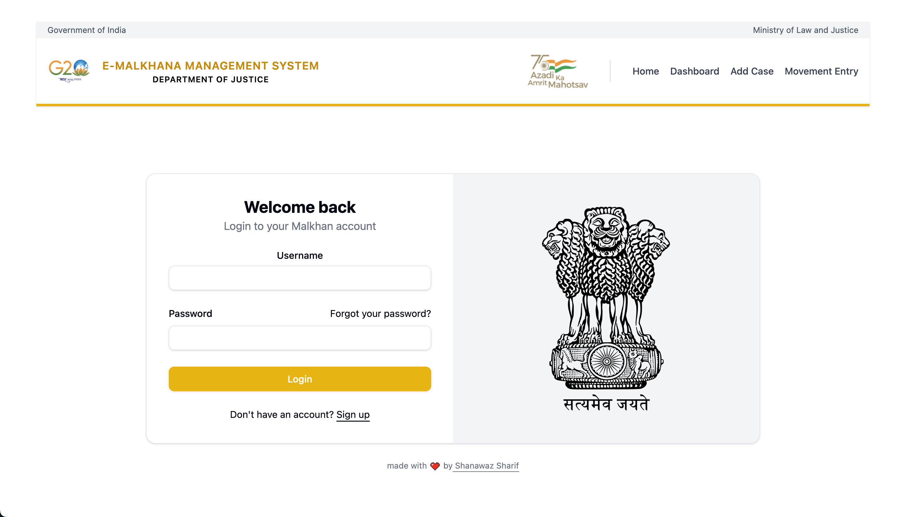
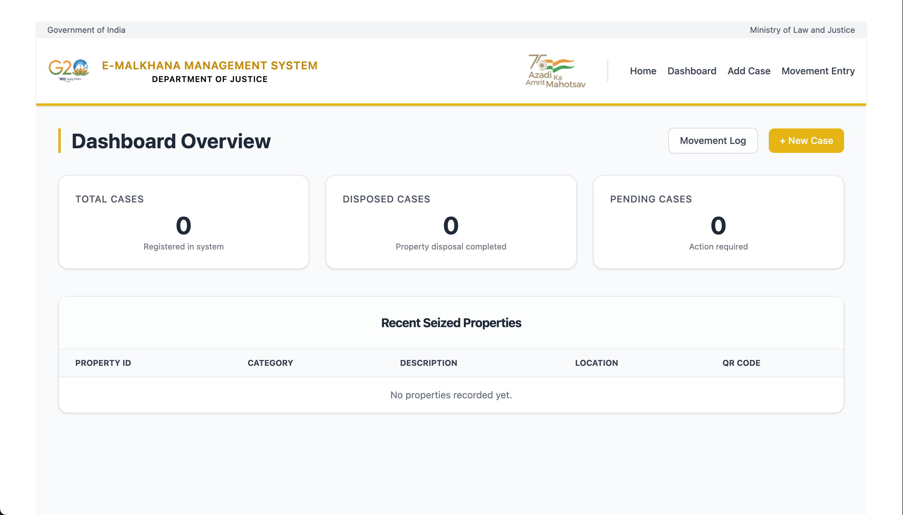
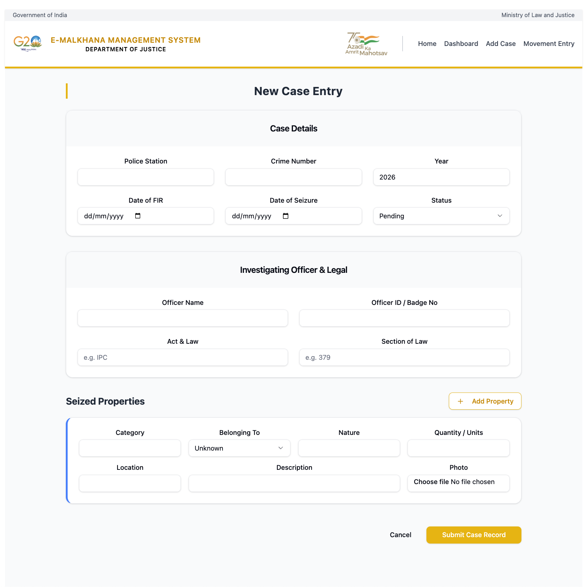
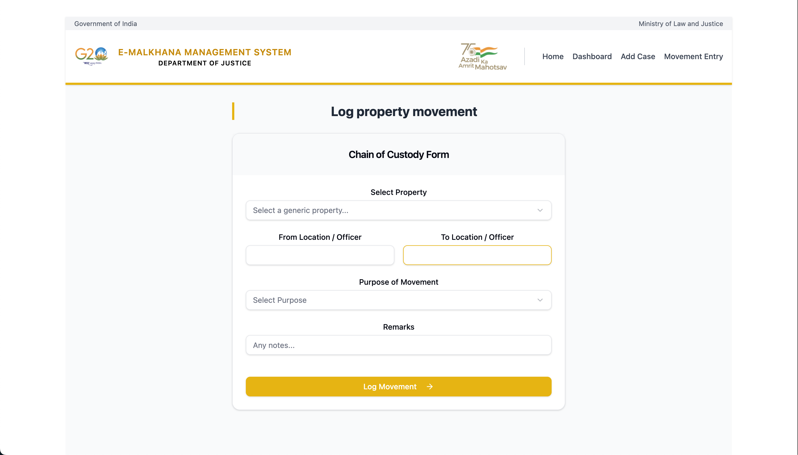

# E-Malkhana Management System


##  Project Overview
The **E-Malkhana Management System** is a digital solution designed for the **Department of Justice** to streamline the management of seized properties (Malkhana). It replaces traditional manual registers with a secure, efficient, and transparent digital "Chain of Custody" log.

Built with an official "Government of India" theme, the system ensures accountability, ease of tracking, and real-time status updates for case properties.


*   **Dashboards**: Real-time visualization of Total, Pending, and Disposed cases.
*   **Chain of Custody**: Complete history tracking of property movement (Storage ↔ Court ↔ FSL) with "From/To", purpose, and timestamps.
*   **QR Code Integration**: Automated QR generation for every seized item for instant scanning and retrieval.
*   **Secure & Compliant**: Designed with official government aesthetics and audit-ready logs.
*   **Digital Case Entry**: Comprehensive forms to log FIR details, investigating officers, and property descriptions.

## 🛠️ Technology Stack

| Component | Technology | Description |

| **Frontend** | React 19 (Vite) | Fast, responsive UI with Tailwind CSS & Shadcn/UI |
| **Backend** | Django REST Framework | Robust API handling, ORM
| **Database** | MySQL | Relational data storage for cases and property logs |


## ⚙️ Installation & Setup

### Prerequisites
*   Python 3.10+
*   Node.js & npm
*   MySQL Server

### 1. Backend Setup (Django)
```bash
# Clone the repository
git clone https://github.com/ShanawazS-bit/e-malkhana.git
cd e-malkhana/backend

# Create Virtual Environment
python3 -m venv venv
source venv/bin/activate  # On Windows: venv\Scripts\activate

# Install Dependencies
pip install -r requirements.txt

# Configure Database (Update settings.py with your MySQL creds)
# Then run migrations:
python manage.py makemigrations
python manage.py migrate

# Start Server
python manage.py runserver
```

### 2. Frontend Setup (React)
```bash
cd ../frontend

# Install Dependencies
npm install

# Start Development Server
npm run dev
```

Visit `http://localhost:5173` to view the application.

## 📸 Screenshots

### 1. Dashboard & Login
| Login Page | Dashboard |
| :---: | :---: |
|  |  |

### 2. Case Management
| Case Entry | Property Movement (Chain of Custody) |
| :---: | :---: |
|  |  |


